# MOTK Shoot — User Guide

A free, browser‑based stop‑motion capture studio. Its basic UVC/webcam workflow
runs on phones, tablets, and modern desktop systems without an app installer.
Optional RAW tethering uses the bundled local Companion/agent. This guide walks
through camera-room work: set up, shoot, check the take, and hand off the result.

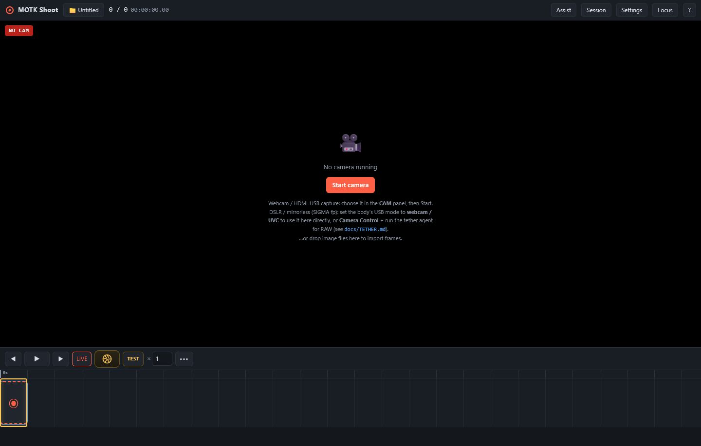

---

## Contents

1. [Start it](#1-start-it)
2. [The interface at a glance](#2-the-interface-at-a-glance)
3. [Connect a camera](#3-connect-a-camera)
4. [Tether — RAW originals & camera control](#4-tether--raw-originals--camera-control)
5. [Shoot frames](#5-shoot-frames)
6. [The timeline (koma grid)](#6-the-timeline-koma-grid)
7. [Captures and immediate corrections](#7-captures-and-immediate-corrections)
8. [Onion skin](#8-onion-skin)
9. [Overlay layers](#9-overlay-layers)
10. [Monitor tools](#10-monitor-tools)
11. [Audio & X‑Sheet (lip sync)](#11-audio--x-sheet-lip-sync)
12. [Playback and take check](#12-playback-and-take-check)
13. [Shot context and session notes](#13-shot-context-and-session-notes)
14. [Local copies and hand‑off](#14-local-copies-and-hand-off)
15. [After Effects round-trip](#15-after-effects-round-trip)
16. [Keyboard shortcuts](#16-keyboard-shortcuts)
17. [Troubleshooting](#17-troubleshooting)

---

## 1. Start it

MOTK Shoot is a static web page — no installer, no account.

```sh
cd motk-shoot
python -m http.server 8321      # or: npx http-server -p 8321
```

Open **http://localhost:8321** in Chrome, Edge, or any modern browser. A camera
needs a *secure context*, which `http://localhost` already is. You can also host
the folder on any static host (Cloudflare Pages, GitHub Pages…) over HTTPS.

Everything you shoot is saved locally in your browser (IndexedDB) by default.
MOTK Shoot does not require GAS. Only context URLs, Companion/tether, Observer,
or bridge features you explicitly configure send their documented data over the
network.

---

## 2. The interface at a glance


- **Top bar** — project name, frame/exposure progress, and four clear work areas:
  **Assist**, **Session**, **Settings**, and **Focus**.
- **Viewport** (centre) — live camera, a reviewed frame, or playback. Onion‑skin
  ghosts of earlier frames show through so you can judge your next pose.
- **Assist** — onion skin, guides, shooting layers, monitor aids, audio, and
  X‑Sheet cues. These affect shooting and do not alter the production plan.
- **Session** — receive a prepared shot list, choose a shot/take, record notes,
  choose a local mirror folder, and finish the session.
- **Settings** — project FPS, camera, optional video assist, and local bridge.
- **Focus** — a full-screen camera-room mode. It keeps only Capture,
  Play/Pause, Hide controls, and Exit visible; **Hide controls** clears the
  screen until the next tap.
- **Transport bar** — immediate take controls. Desktop keeps the full transport
  visible. On a phone, Capture, Live, Play/Pause, and **CAM** remain visible;
  portrait hides step buttons when space is tight, and less-used controls sit
  in the clearly labelled **•••** modal.
- **Timeline** — one slot = one *koma* (exposure) at your frame rate.

On a phone, the same functions are not replaced by a different product. The
top bar becomes compact, panels open as a lower sheet, capture remains within
thumb reach in both portrait and landscape, and Focus mode uses the full display.

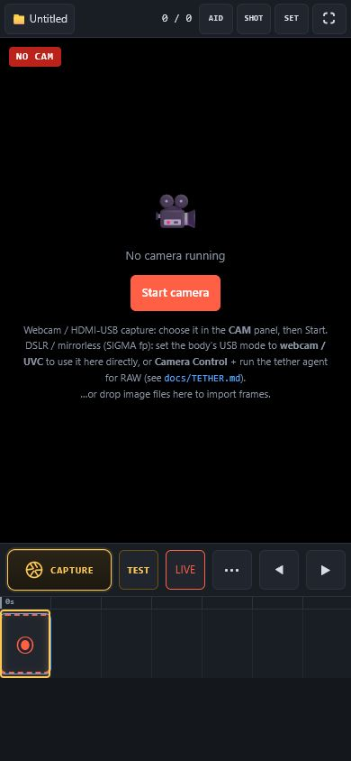

---

## 3. Connect a camera

On a phone, press **CAM** beside Live to choose the front/back/lens source and
resolution in one short modal. On a desktop, open **Settings → Camera** and pick
the camera under **Source**, then press **Start camera** (or **Restart**).

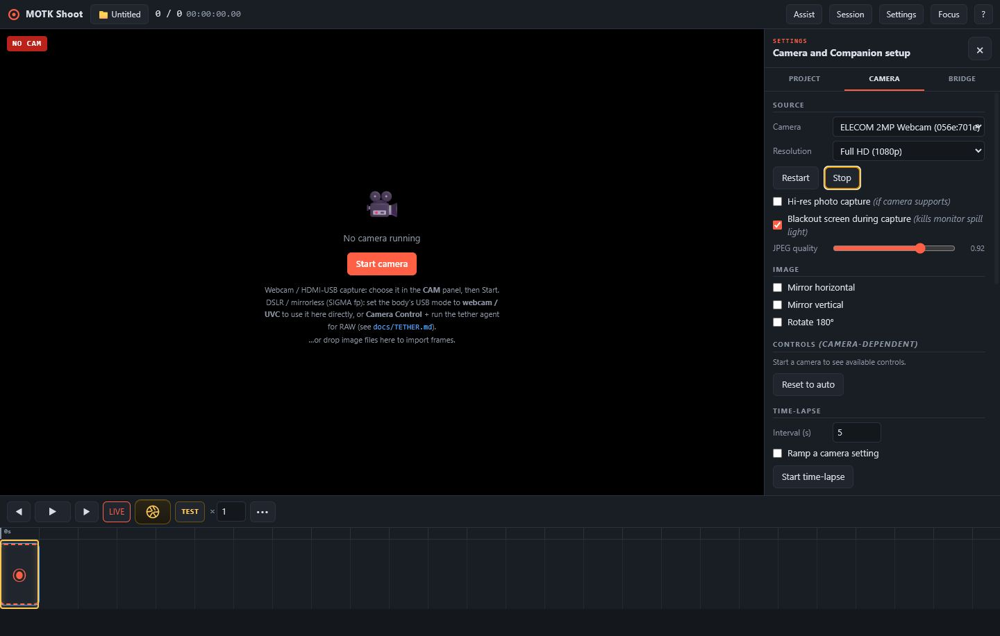

> A camera can only be opened by **one** app at a time. If Start fails with
> "Camera is busy", close the other app or browser tab using it.

On Windows, MOTK Shoot excludes interfaces labelled **Face Authentication** or
**Windows Hello** and uses the normal RGB/UVC interface instead. It also
releases a UVC stream when the page is hidden, minimized, or left, so Windows
Hello can use a composite camera for sign-in. Return to MOTK Shoot and press
**Restart** to resume shooting.

Useful camera options: resolution, **Hi‑res photo capture**, **Blackout screen
during capture** (dims the monitor so it doesn't light your set), JPEG quality,
mirror/rotate, and manual controls (focus, shutter, ISO, white balance) when the
camera exposes them.

### 3.1 Webcam or HDMI‑USB capture (simplest)

1. Plug in a **USB webcam**, or feed a camera's clean **HDMI** output into a
   cheap **HDMI‑USB (UVC) capture** dongle (about US$10–20).
2. In **Settings → Camera → Source**, choose the device.
3. Press **Start camera**. That's it — this gives you live view and capture with
   no extra software.

This path grabs the video stream. It cannot set shutter speed or save RAW — for
that, use the tether below.

### 3.2 DSLR / mirrorless — the two USB modes

A stills camera's USB port works in **one** of two modes, never both at once:

- **Webcam / UVC mode** → shows up as a plain camera (use §3.1). Live view only:
  no RAW, no shutter/ISO control from the app.
- **Camera Control (PTP) mode** → the **tether agent** (below) can fire the real
  shutter, set exposure, and download **RAW** — but there's no UVC video on the
  same cable, so use the camera's **HDMI** out through a capture dongle for live
  view.

The professional rig combines both:

```
camera HDMI (clean out) → HDMI→USB dongle → MOTK Shoot live view
camera USB (Camera Control mode) → tether agent → stills / RAW / settings
```

**SIGMA fp on Windows:** set **メニュー → システム → USBモード →
カメラコントロール** (Camera Control), connect USB, and use the optional
SIGMA SDK backend in §4.3. The Windows live-view path is hardware-verified. Use
HDMI/UVC when you need a faster continuous monitor feed.

---

## 4. Tether — RAW originals & camera control

The browser can't set shutter speed or save RAW. The **tether agent** — a tiny
Node script bundled in `bridge/` — runs next to your camera, fires the **real
shutter** on every MOTK Shoot capture, saves the **RAW/JPEG originals** to disk,
and exposes the camera's settings in the app.

```
[MOTK Shoot (browser)] ←WebSocket→ [tether agent] ←USB→ [camera]
     drives the timeline           SIGMA SDK / gphoto2 / digiCamControl
                                    writes RAW+JPEG to a folder
```

You need **Node 18+** (`node --version`).

### 4.1 Install the camera backend

| OS / camera | Install |
|---|---|
| **macOS** | `brew install gphoto2` |
| **Linux** | `sudo apt install gphoto2` (or your distro's package) |
| **Windows + SIGMA fp** | Use your licensed SIGMA Camera Control SDK ZIP (§4.3). |
| **Windows + Canon/Nikon/Sony** | Use **digiCamControl** (§4.4). |
| **Windows advanced fallback** | gphoto2 can run in WSL2 with USB passthrough; see `docs/TETHER.md`. |

Set the camera to record **RAW+JPEG** so each shot yields both files.

### 4.2 Run the agent (macOS / Linux)

From the `motk-shoot` folder:

```sh
node bridge/production-agent.mjs --dir ~/shoots/scene01
```

Leave that terminal open. Options:
`--port 8793 --dir ./originals --backend auto|sigma|gphoto2|digicam|dummy`.
Then jump to §4.5 to connect the app.

### 4.3 Run the agent on Windows — SIGMA fp SDK

Download `CameraControlSDK_for_Win.zip` from SIGMA and accept SIGMA's license.
Keep the original ZIP outside this project; MOTK Shoot never redistributes its
DLLs or documentation. Then run:

```powershell
node bridge\production-agent.mjs --backend sigma `
  --sigma-sdk-zip "C:\path\to\CameraControlSDK_for_Win.zip" `
  --dir "C:\shoots\scene01"
```

The helper automatically finds the connected fp, extracts only the required
DLLs from your ZIP into your local MOTK Shoot cache, and refuses to overwrite an
existing output path. No camera serial is stored in the project. If automatic
detection fails, `--sigma-serial SERIAL` is available for troubleshooting.

The native SDK connection and live view are verified on a physical SIGMA fp.
The still-transfer path remains hardware acceptance work; until that check is
marked PASS in `docs/HARDWARE_ACCEPTANCE_2026-07-12.md`, keep an HDMI/UVC frame
as the timeline image and do not rely on this backend as the only RAW copy.

The older WSL2/gphoto2 route remains documented in `docs/TETHER.md` for advanced
setups, but it requires WSL2, usbipd-win, and Linux-side camera packages.

### 4.4 Windows fallback: digiCamControl (Canon / Nikon / Sony)

Install [digiCamControl](https://digicamcontrol.com/) (free), then:

```powershell
node bridge\camera-agent.mjs --dir C:\shoots\scene01
# custom install path:
node bridge\camera-agent.mjs --digicam "D:\apps\digiCamControl\CameraControlCmd.exe"
```

digiCamControl fires the shutter and saves originals; it does not (yet) expose
camera settings in the app. It does **not** support SIGMA.

### 4.5 Test the whole pipeline without a camera

```sh
node bridge/production-agent.mjs --backend dummy
```

The dummy backend writes fake `.jpg`/`.raw` files and shows test menus, so you
can learn the workflow before touching hardware.

### 4.6 Connect and shoot in the app

In **Settings → Camera → Tether — RAW originals**, leave the URL at `ws://localhost:8793` and
press **Connect**. When it reads **connected**, the camera's live settings
appear:

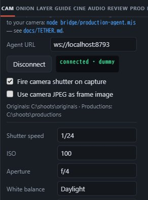

- **Fire camera shutter on capture** — every capture (Enter / shutter button)
  also trips the real camera.
- **Use camera JPEG as frame image** — the camera's own JPEG replaces the
  live‑view grab in the timeline (full sensor quality, not just the HDMI/webcam
  stream).
- **Camera settings** — with the gphoto2 backend the panel lists **shutter
  speed, ISO, aperture, white balance, image format** and more. Changing a menu
  applies it over PTP before the next shot. (The dummy backend shows test menus.)
- **SIGMA fp controls** — the same panel provides **M/P/A/S, shutter,
  aperture, ISO Auto/Manual, ISO, white balance, color mode, image quality, and
  save destination**. These choices are stored with this MOTK Shoot project
  and return after reconnecting. The app applies them in the same SDK session
  used for preview and capture. Leave the body in the exposure mode you want;
  put a SIGMA lens aperture ring in **A/Auto** when MOTK Shoot should control
  the aperture.

Now shoot as usual. Each frame that captured a camera original shows a green
**RAW** badge, and the originals land in the agent's folder (file names
`kdr_YYYYMMDD_HHMMSS_nnnn.<ext>`):

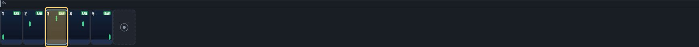

The RAW file names are stored per frame, saved in the project backup, and listed
in **Export → Edit list (CSV)** so you can conform the RAW sequence later in
DaVinci Resolve / After Effects. Agent-managed originals are copied and never
modified.

With Companion, these files are visible under **Camera Originals** below the
FILES root selected in the Control Center. A tethered frame enters the timeline
only after the camera confirms that its file was written. If the camera reports
a shutter or storage error, the frame counter stays unchanged and no provisional
live-view grab is left behind.

### 4.7 PTP live view (no HDMI dongle)

With the SIGMA, gphoto2, or dummy backend connected, choose **Tether live view (PTP)**
in **Settings → Camera → Source**. The agent streams the camera's preview JPEGs (up to ~15 fps)
straight into the viewport — onion skin, guides, and capture all work on it, so
you may not need the HDMI dongle at all. Camera support and speed vary by model;
the fp SDK preview is hardware-confirmed, and UVC/HDMI remains the faster fallback.

### 4.8 Lighting passes, bracketing, focus

Still in the CAM tab, below the tether settings:

- **Exposure passes** — define named presets (e.g. *front‑light*, *back‑light*),
  each overriding only the settings it names. With **Capture all enabled passes
  per frame** on, one capture shoots the whole pass list as a single camera
  transaction, groups every original on the frame (a **P×n** badge), and restores
  the settings afterward.
- **3‑shot bracket** — one click makes three shutter‑speed passes around the
  current value.
- **Focus drive** — buttons appear when the camera exposes `manualfocusdrive`.
- **Time‑lapse ramp** — ramp any menu setting across a shot count; the next shot
  never starts until the previous pass sequence finishes.

---

## 5. Shoot frames

1. Frame your shot in the viewport (mouse wheel = zoom, drag = pan, double‑click
   = reset).
2. Press the **round shutter button** or hit **Enter** to capture a frame.
3. Move your puppet, capture the next — repeat.

Set the **× hold** box next to the shutter to shoot on twos/threes (each capture
then occupies that many koma). Use **TEST** to shoot a throw‑away frame into the
bin *without* adding it to your animation.

For a clear camera-room view, press **Focus**. The full screen keeps only
**Capture**, **Play/Pause**, **Hide controls**, and **Exit**. Press **Hide
controls** to clear every button; tap the picture to restore them. **Exit**
returns to the normal workspace. This is especially useful on iPhone or iPad,
including landscape shooting, but the same mode is available on desktop.
Focus **Play** loops the current take until **Pause** is pressed; it does not
change the project's normal Loop setting.

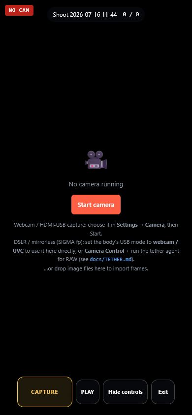

On phones, press **•••** for the operations that do not need to occupy the
shutter strip: First/Last frame, Loop, Short play, Test shot, Exposure hold,
Remove frame, Undo/Redo, and Captures bin. The modal uses full labels instead of
an unexplained row of icons.

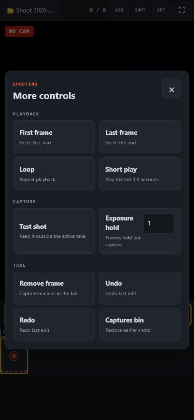

---

## 6. The timeline (koma grid)

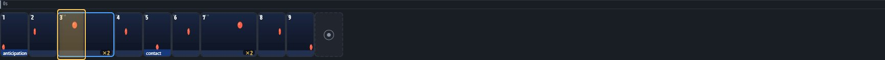

Every slot is one **koma** (exposure). A frame held for *n* koma is *n* slots
wide, with tick marks showing each koma; the ruler marks whole seconds.

- **Click** a slot to review that exact koma (the yellow cursor).
- **Drag the right edge** of a frame to add/remove koma — the hold grows in whole
  koma, it does not just zoom.
- **Drag a frame** to reorder it.
- Badges: **×2** = hold, **RAW** = camera original on disk, **P×2** = lighting
  passes, and per‑frame **notes** (e.g. "anticipation", "contact").
- **Right‑click** a frame for duplicate, set hold, insert black, save JPEG,
  remove, and more.

---

## 7. Captures and immediate corrections

Every captured frame stays in the **Captures bin**; the visible take is a
reference list. The shooting controls cover immediate on-set corrections:

- **Undo / redo** everything with **Ctrl+Z / Ctrl+Shift+Z**.
- Deleting a frame only removes it from the edit; reopen it any time from the
  **🗂 bin**.

Older projects can still contain alternate edits and editorial metadata, so the
data remains readable. Creating cuts, A/B editorial comparison, and delivery
package management are intentionally outside the normal MOTK Shoot interface.
Use an editor or the appropriate external tool after shooting.

---

## 8. Onion skin

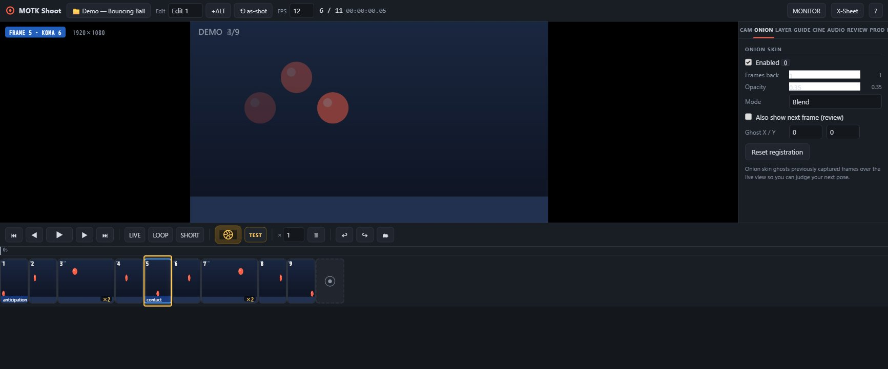

**Assist → Onion** ghosts previous (and optionally next) frames over the live view
so you can line up your next move. Set how many frames back, the opacity, and
**Blend** vs **Difference** mode.

---

## 9. Overlay layers

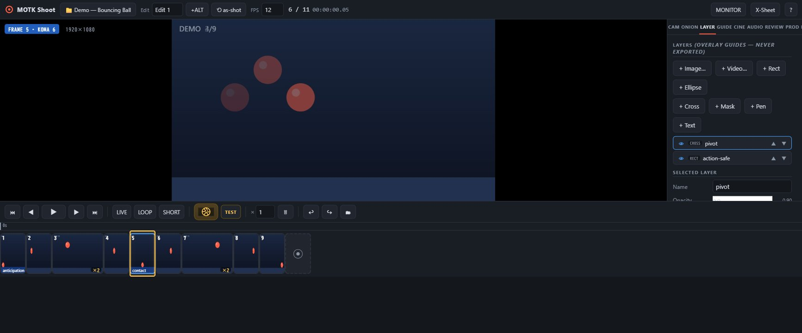

**Assist → Layers** adds guide overlays that are drawn on the monitor but **never
exported**:

- **Image / Video** reference (rotoscope) — a video layer steps with your koma.
- **Rect / Ellipse / Cross / Mask** primitives and garbage masks.
- **Pen / Text** annotations.

Each layer has opacity, position, scale, rotation, and **keyframes** so a guide
can move across koma. Drag a selected layer right in the viewport.

---

## 10. Monitor tools

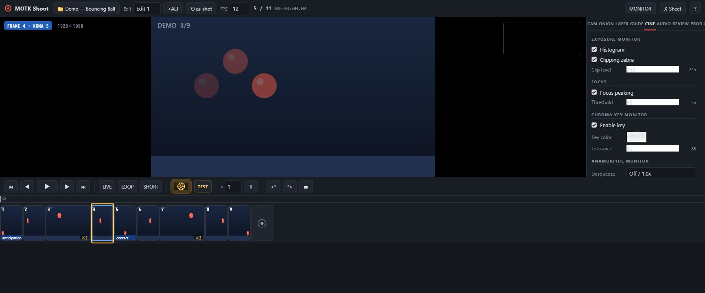

**Assist → Monitor** adds non‑destructive monitor aids: **histogram + clipping
zebra** (exposure), **focus peaking**, **chroma‑key** preview (reveals a "behind"
layer), and **anamorphic desqueeze**. These affect only what you see, not the
saved frames.

---

## 11. Audio & X‑Sheet (lip sync)

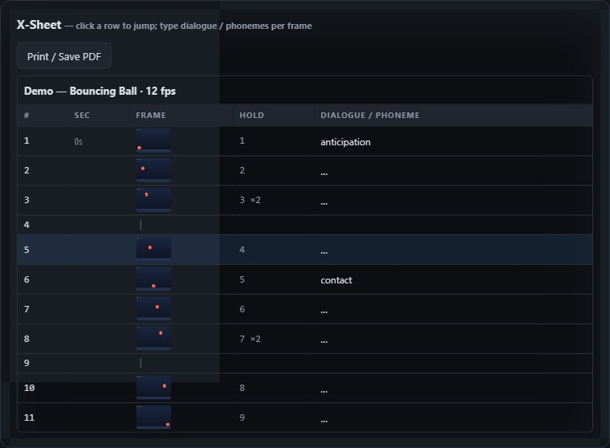

Load one or more audio tracks in **Assist → Audio** (waveform, offset, volume,
mute; audio scrubs as you step). Open the **X‑Sheet** there (or press **X**) to see
every koma in a column and type **dialogue / phonemes** per frame — pair it with
face‑set layers for lip sync.

---

## 12. Playback and take check

Press **Space** or **▶** to play at your project FPS. On desktop the full
transport remains visible. On phones, **•••** opens the More controls modal,
including loop and short playback of the last 1.5 seconds.
Click a frame to check it, step to compare adjacent poses, and hold **P** to flip
momentarily between the selected frame and live.

This is immediate shooting review, not an editorial room. A/B cut comparison
and alternate-edit building are not part of the normal shooting workflow.

---

## 13. Shot context and session notes

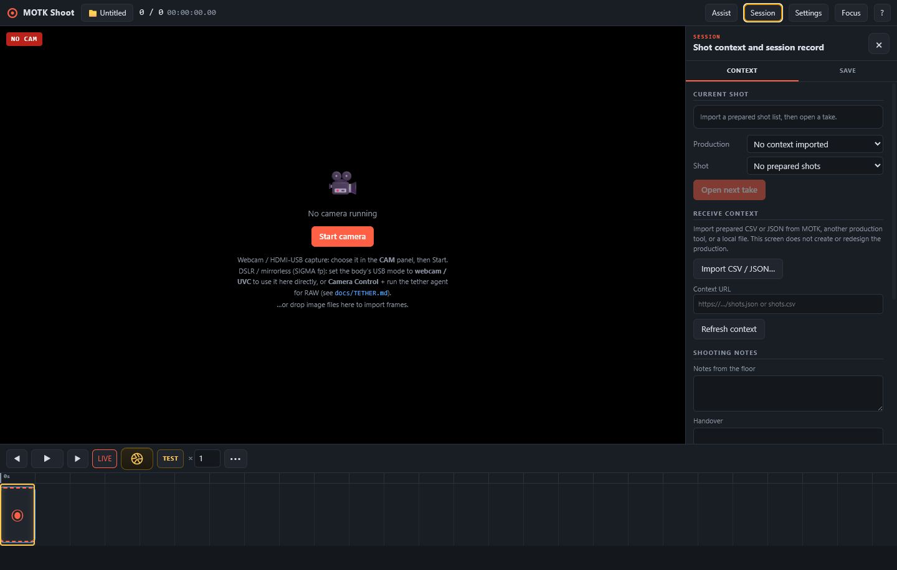

Open **Session → Context** when the production prepared the shot list elsewhere:

1. Import a prepared **CSV or JSON** file from MOTK, a spreadsheet, or another
   production tool. You can also refresh a CSV/JSON context URL when its server
   permits browser access.
2. Select the production and shot, then press **Open next take**.
3. Shoot. Record **Notes from the floor** and **Handover** without changing the
   production plan.
4. Press **Finish session** to save the result: captures, exposures, duration,
   notes, and handover.

MOTK Shoot does not require GAS, create productions, add shots, or manage Google
Sheets. GAS-era project data remains compatible, but new sessions use the
neutral CSV/JSON intake. Planning stays in MOTK or the owner's chosen system.

---

## 14. Local copies and hand‑off

Open **Session → Save**. Every capture already has a project-scoped recovery copy
in browser storage.

The default **Settings → Project → When MOTK Shoot opens** option starts a new
shoot after the browser session closes. Previous images remain closed until you
open **Projects → Open project**. Reloading the same tab, stopping the camera,
or restarting it keeps that tab's shoot. Choose **Reopen the last project on
this device** only when the same phone or workstation should return to its last
project on the next browser session.

Open **Settings → Project → Capture storage** (or **••• → Capture storage** on a
phone) to see the exact active arrangement. The primary copy is IndexedDB in
this browser profile on this device. It is local, but it is not visible as an
ordinary Files folder and will be erased if site data is cleared.

- On compatible desktop Chrome/Edge browsers, **Choose folder** mirrors each new
  JPEG to `<chosen folder>/<project>/frames`; TEST images go to `tests`.
- On iPhone and iPad, browsers cannot keep a persistent arbitrary folder. Use
  **Save / Share backup** to send the session to Files, AirDrop, or another
  share destination.
- For RAW originals, vendor SDK control, and a trusted production disk root,
  use the optional local Companion/tether agent.

The chosen mirror never replaces browser storage, and MOTK Shoot never silently
overwrites an existing file. Disconnecting it only stops future copies.

Older project backups and export metadata remain readable for compatibility.
Movie mastering and editorial interchange belong in the post-production tool,
not in the normal camera-room interface.

---

## 15. After Effects round-trip

Open **Session → Save** and use the three numbered cards.

1. **Prepare:** add a previs image/movie if available, set the planned frame
   length, and create the AE project package. This works before the first frame
   is photographed. Choose a shared/NAS folder for live exchange, or leave it
   unselected to download a ZIP.
2. **Send layer:** after photographing a character/pass, enter its human name
   and publish the current take. This creates the next immutable
   `delivery_####`; it does not rebuild the `.aep`.
3. **Return:** the compositor renders a preview and runs the supplied
   `PUBLISH_RETURN.jsx`. **Watch returns** loads each completed version from the
   shared folder, while **Import preview…** accepts a manually transferred file.

On the Mac, use **File → Scripts → Run Script File…** in After Effects. Run
`BUILD_MOTK_AE_PROJECT.jsx` once for a MOTK-created project, then run each
delivery's `IMPORT_MOTK_DELIVERY.jsx` in the existing project. If you already
made a previs `.aep` independently, save it, make the receiving comp active,
and run the delivery importer directly.

Returned comps appear Behind the live image as guide layers. A newer return
hides the previous one but does not delete it. Returns never enter the capture
bin or alter camera originals. See
[the full AE round-trip contract](AFTER_EFFECTS_ROUNDTRIP.md).

---

## 16. Keyboard shortcuts

| Key | Action | Key | Action |
|---|---|---|---|
| **Enter** | Capture frame | **Space** | Play / stop |
| **1 / ←** | Step back a koma | **2 / →** | Step forward a koma |
| **3** | Toggle live view | **4** | Short play |
| **O** | Onion skin on/off | **L** | Loop on/off |
| **G** | Cycle grid | **M** | Mute audio |
| **Home / End** | First / last frame | **Del** | Remove from edit (kept in bin) |
| **+ / −** | Hold +1 / −1 koma | **D** | Duplicate frame |
| **Ctrl+Z** | Undo | **Ctrl+Shift+Z / Ctrl+Y** | Redo |
| **P** (hold) | Flip live ↔ frame | **X** | X‑Sheet |
| **?** | Shortcut help | | |

---

## 17. Troubleshooting

**The webcam doesn't show / the screen looks frozen on a frame.**
MOTK Shoot opens on the live view when a camera is present. If you see a still
frame instead, click **LIVE** (or press **3**). If the badge says **NO CAM**,
the camera didn't start — see below.

**"Camera is busy" or Start camera fails.**
Only one program can use a camera at a time. Close any other app or browser tab
that has it open (Zoom, OBS, another MOTK Shoot tab), then press **Start
camera**.

**Windows Hello stopped seeing my external face camera.**
MOTK Shoot does not select the Face Authentication interface and releases its
normal camera stream whenever the page is hidden. Press **Stop** before testing
Windows Hello immediately, then press **Restart** afterward. If Windows still
cannot use it, check **Windows Settings → Accounts → Sign-in options** and the
external-camera / Enhanced sign-in security setting. External cameras may not
be compatible with Enhanced sign-in security.

**My SIGMA fp / DSLR isn't in the camera list.**
"Just plugged in" isn't enough. Set the camera body's **USB mode** to
**webcam / UVC** to use it as a camera here, or **Camera Control** for RAW via
the tether agent — see [§4, Tether](#4-tether--raw-originals--camera-control)
for the full setup. The camera list refreshes automatically when you change
modes or replug.

**I updated the app but don't see the changes.**
Do a hard refresh: **Ctrl+Shift+R** (Windows/Linux) or **Cmd+Shift+R** (Mac).

**Where are my projects?**
In IndexedDB inside this browser profile on this device. Open **Settings →
Project → Capture storage** to see whether a second folder mirror is connected.
Use **Save / Share backup** regularly to keep a `.zip` in a normal Files folder,
iCloud Drive, AirDrop destination, or other chosen location. Clearing browser
data for the site erases the browser copy, so back up first.

---

*MOTK Shoot is free and open source (MIT). Part of the MOTK tool family. If it
helps your film, consider supporting via the links at
stopmotiondatabase.com/tools.*
