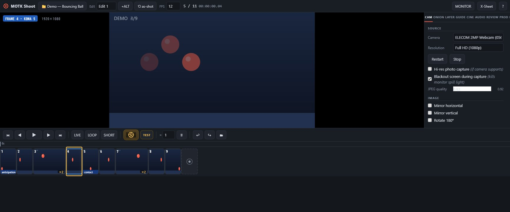
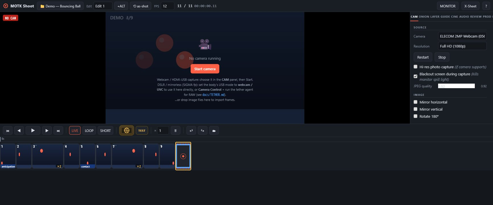
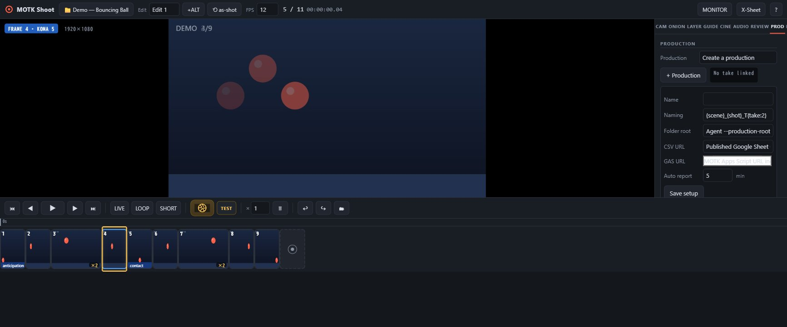
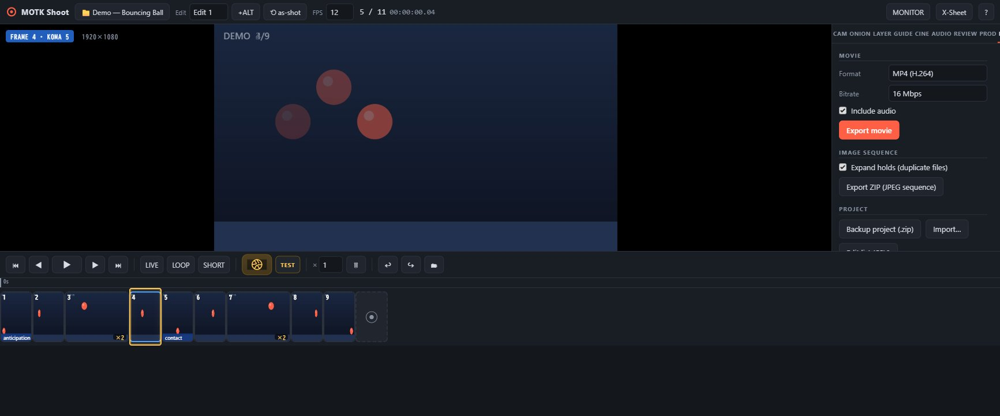

# MOTK Shoot — User Guide

A free, browser‑based stop‑motion capture studio. Its basic UVC/webcam workflow
runs on any modern desktop OS without an app installer. Optional RAW tethering
uses the bundled Node agent. This guide walks through everyday shooting,
editing, and delivery with screenshots of the real app.



---

## Contents

1. [Start it](#1-start-it)
2. [The interface at a glance](#2-the-interface-at-a-glance)
3. [Connect a camera](#3-connect-a-camera)
4. [Tether — RAW originals & camera control](#4-tether--raw-originals--camera-control)
5. [Shoot frames](#5-shoot-frames)
6. [The timeline (koma grid)](#6-the-timeline-koma-grid)
7. [Non‑destructive editing](#7-non-destructive-editing)
8. [Onion skin](#8-onion-skin)
9. [Overlay layers](#9-overlay-layers)
10. [Monitor tools](#10-monitor-tools)
11. [Audio & X‑Sheet (lip sync)](#11-audio--x-sheet-lip-sync)
12. [Playback & review](#12-playback--review)
13. [Production management](#13-production-management)
14. [Export & editorial hand‑off](#14-export--editorial-hand-off)
15. [Keyboard shortcuts](#15-keyboard-shortcuts)
16. [Troubleshooting](#16-troubleshooting)

---

## 1. Start it

MOTK Shoot is a static web page — no installer, no account.

```sh
cd motk-shoot
python -m http.server 8321      # or: npx http-server -p 8321
```

Open **http://localhost:8321** in Chrome, Edge, or any modern browser. A camera
needs a *secure context*, which `http://localhost` already is. You can also host
the folder on any static host (Cloudflare Pages, GitHub Pages…) over HTTPS.

Everything you shoot is saved locally in your browser (IndexedDB) by default.
Only features you explicitly configure—Google Sheet sync, Apps Script, or an
external WebSocket bridge—send their documented data over the network.

---

## 2. The interface at a glance


- **Top bar** — project name, the **Edit / +ALT / ⟲ as‑shot** controls (see
  [editing](#7-non-destructive-editing)), **FPS**, the frame / exposure counter,
  timecode, and the **MONITOR** and **X‑Sheet** buttons.
- **Viewport** (centre) — live camera, a reviewed frame, or playback. Onion‑skin
  ghosts of earlier frames show through so you can judge your next pose.
- **Side panel** (right) — tabs: **CAM · ONION · LAYER · GUIDE · CINE · AUDIO ·
  REVIEW · PROD · EXPORT · LINK**.
- **Transport bar** — first/step/play/last, LIVE / LOOP / SHORT, the round
  **shutter** capture button, **TEST**, per‑capture hold ×, delete, undo/redo,
  and the **🗂 bin**.
- **Timeline** — one slot = one *koma* (exposure) at your frame rate.

---

## 3. Connect a camera

Open the **CAM** tab and pick your camera under **Source**, then press
**Start camera** (or **Restart**). If none is running you'll see this:



> A camera can only be opened by **one** app at a time. If Start fails with
> "Camera is busy", close the other app or browser tab using it.

On Windows, MOTK Shoot excludes interfaces labelled **Face Authentication** or
**Windows Hello** and uses the normal RGB/UVC interface instead. It also
releases a UVC stream when the page is hidden, minimized, or left, so Windows
Hello can use a composite camera for sign-in. Return to MOTK Shoot and press
**Restart** to resume shooting.

Useful **CAM** options: resolution, **Hi‑res photo capture**, **Blackout screen
during capture** (dims the monitor so it doesn't light your set), JPEG quality,
mirror/rotate, and manual controls (focus, shutter, ISO, white balance) when the
camera exposes them.

### 3.1 Webcam or HDMI‑USB capture (simplest)

1. Plug in a **USB webcam**, or feed a camera's clean **HDMI** output into a
   cheap **HDMI‑USB (UVC) capture** dongle (about US$10–20).
2. In **CAM → Source**, choose the device.
3. Press **Start camera**. That's it — this gives you live view and capture with
   no extra software.

This path grabs the video stream. It cannot set shutter speed or save RAW — for
that, use the tether below.

### 3.2 DSLR / mirrorless — the two USB modes

A stills camera's USB port works in **one** of two modes, never both at once:

- **Webcam / UVC mode** → shows up as a plain camera (use §3.1). Live view only:
  no RAW, no shutter/ISO control from the app.
- **Camera Control (PTP) mode** → the **tether agent** (below) can fire the real
  shutter, set exposure, and download **RAW** — but there's no UVC video on the
  same cable, so use the camera's **HDMI** out through a capture dongle for live
  view.

The professional rig combines both:

```
camera HDMI (clean out) → HDMI→USB dongle → MOTK Shoot live view
camera USB (Camera Control mode) → tether agent → stills / RAW / settings
```

**SIGMA fp on Windows:** set **メニュー → システム → USBモード →
カメラコントロール** (Camera Control), connect USB, and use the optional
SIGMA SDK backend in §4.3. The Windows live-view path is hardware-verified. Use
HDMI/UVC when you need a faster continuous monitor feed.

---

## 4. Tether — RAW originals & camera control

The browser can't set shutter speed or save RAW. The **tether agent** — a tiny
Node script bundled in `bridge/` — runs next to your camera, fires the **real
shutter** on every MOTK Shoot capture, saves the **RAW/JPEG originals** to disk,
and exposes the camera's settings in the app.

```
[MOTK Shoot (browser)] ←WebSocket→ [tether agent] ←USB→ [camera]
     drives the timeline           SIGMA SDK / gphoto2 / digiCamControl
                                    writes RAW+JPEG to a folder
```

You need **Node 18+** (`node --version`).

### 4.1 Install the camera backend

| OS / camera | Install |
|---|---|
| **macOS** | `brew install gphoto2` |
| **Linux** | `sudo apt install gphoto2` (or your distro's package) |
| **Windows + SIGMA fp** | Use your licensed SIGMA Camera Control SDK ZIP (§4.3). |
| **Windows + Canon/Nikon/Sony** | Use **digiCamControl** (§4.4). |
| **Windows advanced fallback** | gphoto2 can run in WSL2 with USB passthrough; see `docs/TETHER.md`. |

Set the camera to record **RAW+JPEG** so each shot yields both files.

### 4.2 Run the agent (macOS / Linux)

From the `motk-shoot` folder:

```sh
node bridge/production-agent.mjs --dir ~/shoots/scene01
```

Leave that terminal open. Options:
`--port 8793 --dir ./originals --backend auto|sigma|gphoto2|digicam|dummy`.
Then jump to §4.5 to connect the app.

### 4.3 Run the agent on Windows — SIGMA fp SDK

Download `CameraControlSDK_for_Win.zip` from SIGMA and accept SIGMA's license.
Keep the original ZIP outside this project; MOTK Shoot never redistributes its
DLLs or documentation. Then run:

```powershell
node bridge\production-agent.mjs --backend sigma `
  --sigma-sdk-zip "C:\path\to\CameraControlSDK_for_Win.zip" `
  --dir "C:\shoots\scene01"
```

The helper automatically finds the connected fp, extracts only the required
DLLs from your ZIP into your local MOTK Shoot cache, and refuses to overwrite an
existing output path. No camera serial is stored in the project. If automatic
detection fails, `--sigma-serial SERIAL` is available for troubleshooting.

The native SDK connection and live view are verified on a physical SIGMA fp.
The still-transfer path remains hardware acceptance work; until that check is
marked PASS in `docs/HARDWARE_ACCEPTANCE_2026-07-12.md`, keep an HDMI/UVC frame
as the timeline image and do not rely on this backend as the only RAW copy.

The older WSL2/gphoto2 route remains documented in `docs/TETHER.md` for advanced
setups, but it requires WSL2, usbipd-win, and Linux-side camera packages.

### 4.4 Windows fallback: digiCamControl (Canon / Nikon / Sony)

Install [digiCamControl](https://digicamcontrol.com/) (free), then:

```powershell
node bridge\camera-agent.mjs --dir C:\shoots\scene01
# custom install path:
node bridge\camera-agent.mjs --digicam "D:\apps\digiCamControl\CameraControlCmd.exe"
```

digiCamControl fires the shutter and saves originals; it does not (yet) expose
camera settings in the app. It does **not** support SIGMA.

### 4.5 Test the whole pipeline without a camera

```sh
node bridge/production-agent.mjs --backend dummy
```

The dummy backend writes fake `.jpg`/`.raw` files and shows test menus, so you
can learn the workflow before touching hardware.

### 4.6 Connect and shoot in the app

In **CAM → Tether — RAW originals**, leave the URL at `ws://localhost:8793` and
press **Connect**. When it reads **connected**, the camera's live settings
appear:


- **Fire camera shutter on capture** — every capture (Enter / shutter button)
  also trips the real camera.
- **Use camera JPEG as frame image** — the camera's own JPEG replaces the
  live‑view grab in the timeline (full sensor quality, not just the HDMI/webcam
  stream).
- **Camera settings** — with the gphoto2 backend the panel lists **shutter
  speed, ISO, aperture, white balance, image format** and more. Changing a menu
  applies it over PTP before the next shot. (The dummy backend shows test menus.)

Now shoot as usual. Each frame that captured a camera original shows a green
**RAW** badge, and the originals land in the agent's folder (file names
`kdr_YYYYMMDD_HHMMSS_nnnn.<ext>`):


The RAW file names are stored per frame, saved in the project backup, and listed
in **Export → Edit list (CSV)** so you can conform the RAW sequence later in
DaVinci Resolve / After Effects. Agent-managed originals are copied and never
modified.

### 4.7 PTP live view (no HDMI dongle)

With the SIGMA, gphoto2, or dummy backend connected, choose **Tether live view (PTP)**
in **CAM → Source**. The agent streams the camera's preview JPEGs (up to ~15 fps)
straight into the viewport — onion skin, guides, and capture all work on it, so
you may not need the HDMI dongle at all. Camera support and speed vary by model;
the fp SDK preview is hardware-confirmed, and UVC/HDMI remains the faster fallback.

### 4.8 Lighting passes, bracketing, focus

Still in the CAM tab, below the tether settings:

- **Exposure passes** — define named presets (e.g. *front‑light*, *back‑light*),
  each overriding only the settings it names. With **Capture all enabled passes
  per frame** on, one capture shoots the whole pass list as a single camera
  transaction, groups every original on the frame (a **P×n** badge), and restores
  the settings afterward.
- **3‑shot bracket** — one click makes three shutter‑speed passes around the
  current value.
- **Focus drive** — buttons appear when the camera exposes `manualfocusdrive`.
- **Time‑lapse ramp** — ramp any menu setting across a shot count; the next shot
  never starts until the previous pass sequence finishes.

---

## 5. Shoot frames

1. Frame your shot in the viewport (mouse wheel = zoom, drag = pan, double‑click
   = reset).
2. Press the **round shutter button** or hit **Enter** to capture a frame.
3. Move your puppet, capture the next — repeat.

Set the **× hold** box next to the shutter to shoot on twos/threes (each capture
then occupies that many koma). Use **TEST** to shoot a throw‑away frame into the
bin *without* adding it to your animation.

---

## 6. The timeline (koma grid)


Every slot is one **koma** (exposure). A frame held for *n* koma is *n* slots
wide, with tick marks showing each koma; the ruler marks whole seconds.

- **Click** a slot to review that exact koma (the yellow cursor).
- **Drag the right edge** of a frame to add/remove koma — the hold grows in whole
  koma, it does not just zoom.
- **Drag a frame** to reorder it.
- Badges: **×2** = hold, **RAW** = camera original on disk, **P×2** = lighting
  passes, and per‑frame **notes** (e.g. "anticipation", "contact").
- **Right‑click** a frame for duplicate, set hold, insert black, save JPEG,
  remove, and more.

---

## 7. Non‑destructive editing

Nothing you do on the timeline destroys a shot. Every captured frame lives
forever in the **🗂 Captures bin**; the timeline is just a reference list.

- **Undo / redo** everything with **Ctrl+Z / Ctrl+Shift+Z**.
- **+ALT** duplicates the current cut as an alternate edit — experiment freely,
  the original is untouched. Switch cuts from the **Edit** dropdown.
- **⟲ as‑shot** rebuilds the current edit exactly as you filmed it (capture
  order, shot holds).
- Deleting a frame only removes it from the edit; reopen it any time from the
  **🗂 bin**.

---

## 8. Onion skin


The **ONION** tab ghosts previous (and optionally next) frames over the live view
so you can line up your next move. Set how many frames back, the opacity, and
**Blend** vs **Difference** mode.

---

## 9. Overlay layers


The **LAYER** tab adds guide overlays that are drawn on the monitor but **never
exported**:

- **Image / Video** reference (rotoscope) — a video layer steps with your koma.
- **Rect / Ellipse / Cross / Mask** primitives and garbage masks.
- **Pen / Text** annotations.

Each layer has opacity, position, scale, rotation, and **keyframes** so a guide
can move across koma. Drag a selected layer right in the viewport.

---

## 10. Monitor tools


The **CINE** tab adds non‑destructive monitor aids: **histogram + clipping
zebra** (exposure), **focus peaking**, **chroma‑key** preview (reveals a "behind"
layer), and **anamorphic desqueeze**. These affect only what you see, not the
saved frames.

---

## 11. Audio & X‑Sheet (lip sync)


Load one or more audio tracks in the **AUDIO** tab (waveform, offset, volume,
mute; audio scrubs as you step). Open the **X‑Sheet** (top bar or **X**) to see
every koma in a column and type **dialogue / phonemes** per frame — pair it with
face‑set layers for lip sync.

---

## 12. Playback & review

Press **Space** or **▶** to play at your project FPS. **LOOP** repeats, **SHORT**
plays just the last 1.5 seconds, and you can set a speed (0.25/0.5/1/2×) and an
in/out loop range. The **REVIEW** tab shows two edits or two takes side‑by‑side
for comparison. Hold **P** to flip momentarily between the selected frame and
live.

---

## 13. Production management



This is what Dragonframe doesn't do. In the **PROD** tab you manage a whole
production:

1. **Create a production** and set a **naming pattern** (e.g.
   `{scene}_{shot}_T{take:2}` → `SC010_C020_T03`).
2. Pull your shot list from a **published Google Sheet (CSV)** or a **user‑owned
   MOTK Apps Script** endpoint — or add shots inline, one row at a time.
3. Pick a shot and click **New take**: a correctly‑named project is created in
   one click; you just keep adding takes.
4. Per‑shot **notes** and **handover (申し送り)** flow back to the sheet, along
   with take results (frames, duration, RAW count) on **End session** or the
   auto‑report interval.

With the production agent running, each take's **JPEGs, RAW originals, audio,
metadata, report and backup** are mirrored into **one self‑contained folder** per
shot — portable, and linkable to MOTK / MOTK3D pipelines.

---

## 14. Export & editorial hand‑off



The **EXPORT** tab produces:

- **Movie** (MP4 / WebM, with audio) and **numbered JPEG sequence** (ZIP).
- **Project backup** (`.zip`) that re‑imports losslessly, and an **edit‑list
  CSV**.
- **Editorial interchange** — **CMX3600 EDL**, **FCPXML 1.10**, **AAF‑lite JSON**
  and a **conform recipe** (ProRes 422 HQ / DNxHR HQ / H.264 ffmpeg commands)
  for finishing in DaVinci Resolve, Premiere, or Final Cut, with your RAW file
  mapping preserved.

For a frame‑exact master, export the JPEG/RAW sequence and encode with ffmpeg
using the generated recipe.

---

## 15. Keyboard shortcuts

| Key | Action | Key | Action |
|---|---|---|---|
| **Enter** | Capture frame | **Space** | Play / stop |
| **1 / ←** | Step back a koma | **2 / →** | Step forward a koma |
| **3** | Toggle live view | **4** | Short play |
| **O** | Onion skin on/off | **L** | Loop on/off |
| **G** | Cycle grid | **M** | Mute audio |
| **Home / End** | First / last frame | **Del** | Remove from edit (kept in bin) |
| **+ / −** | Hold +1 / −1 koma | **D** | Duplicate frame |
| **Ctrl+Z** | Undo | **Ctrl+Shift+Z / Ctrl+Y** | Redo |
| **P** (hold) | Flip live ↔ frame | **X** | X‑Sheet |
| **?** | Shortcut help | | |

---

## 16. Troubleshooting

**The webcam doesn't show / the screen looks frozen on a frame.**
MOTK Shoot opens on the live view when a camera is present. If you see a still
frame instead, click **LIVE** (or press **3**). If the badge says **NO CAM**,
the camera didn't start — see below.

**"Camera is busy" or Start camera fails.**
Only one program can use a camera at a time. Close any other app or browser tab
that has it open (Zoom, OBS, another MOTK Shoot tab), then press **Start
camera**.

**Windows Hello stopped seeing my external face camera.**
MOTK Shoot does not select the Face Authentication interface and releases its
normal camera stream whenever the page is hidden. Press **Stop** before testing
Windows Hello immediately, then press **Restart** afterward. If Windows still
cannot use it, check **Windows Settings → Accounts → Sign-in options** and the
external-camera / Enhanced sign-in security setting. External cameras may not
be compatible with Enhanced sign-in security.

**My SIGMA fp / DSLR isn't in the camera list.**
"Just plugged in" isn't enough. Set the camera body's **USB mode** to
**webcam / UVC** to use it as a camera here, or **Camera Control** for RAW via
the tether agent — see [§4, Tether](#4-tether--raw-originals--camera-control)
for the full setup. The camera list refreshes automatically when you change
modes or replug.

**I updated the app but don't see the changes.**
Do a hard refresh: **Ctrl+Shift+R** (Windows/Linux) or **Cmd+Shift+R** (Mac).

**Where are my projects?**
In your browser's local storage for this site. Use **Export → Backup project**
regularly to keep a `.zip` on disk. Clearing browser data for the site erases
local projects, so back up first.

---

*MOTK Shoot is free and open source (MIT). Part of the MOTK tool family. If it
helps your film, consider supporting via the links at
stopmotiondatabase.com/tools.*
